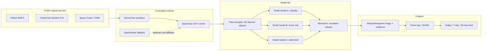

# Architecture

## Overview

The system is designed as a safe, long-running Starlink fleet triage loop rather than a chatbot or generic satellite dashboard.

## Execution pattern

1. Select a representative Starlink sample fleet
2. Ingest public orbit and space-environment signals
3. Normalize each satellite snapshot into a structured record
4. Run lightweight models first
5. Escalate red, disputed, or low-confidence cases to `Nemotron`
6. Persist the full decision trail
7. Generate today, 7-day, and 30-day briefs

## Design principles

- Safety first: all execution stays inside `NemoClaw`
- Longevity first: `OpenClaw` keeps the loop alive for long runs
- Cost awareness: small models do the default work
- Escalation only when needed: reserve `Nemotron` for harder cases
- Replayability: every result must be reconstructable from the log
- Fleet focus: Starlink is the main object set; MEO/GEO are optional benchmark references, not the core demo
