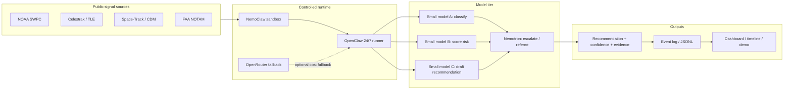

# Architecture

## Overview

The system is designed as a safe, long-running decision loop rather than a chatbot.

## Execution pattern

1. Ingest a small number of high-value events
2. Normalize each event into a structured record
3. Run lightweight models first
4. Escalate only when uncertainty or risk is high
5. Persist the full decision trail

## Design principles

- Safety first: all execution stays inside `NemoClaw`
- Longevity first: `OpenClaw` keeps the loop alive for long runs
- Cost awareness: small models do the default work
- Escalation only when needed: reserve `Nemotron` for harder cases
- Replayability: every result must be reconstructable from the log
